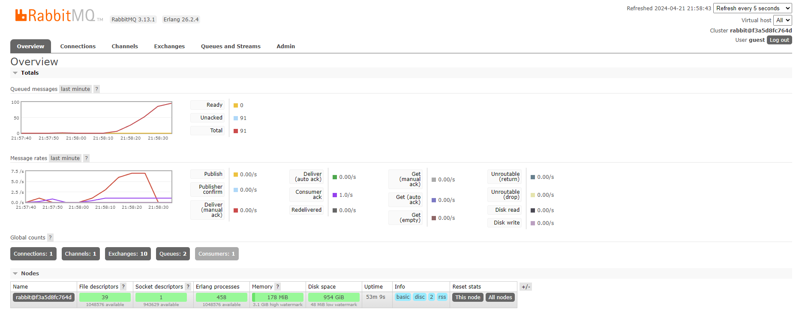
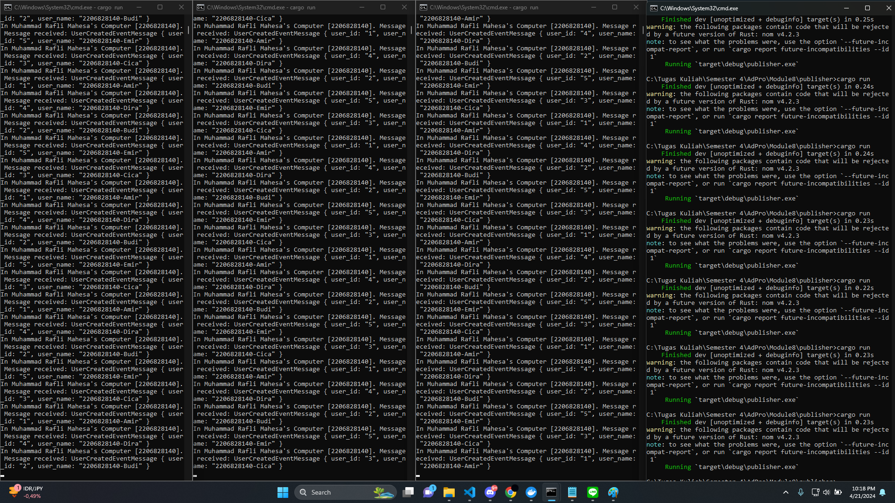
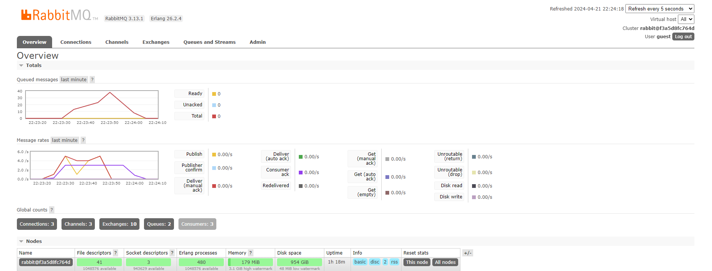

# Understanding  subscriber and message broker

1. What is amqp?

AMQP merupakan singkatan dari Advanced Message Queuing Protocol. AMQP bekerja sebagai protokol jaringan yang memfasilitasi pertukaran data antara sistem yang terpisah. Ini dilakukan dengan menentukan serangkaian aturan untuk format, mengirim, menerima, dan menafsirkan data. Dengan menggunakan AQMP pada RUST, kita dapat mengimplementasikan sistem antar layanan yang efisien yang dapat mengirimkan pesan seperti *event*, *request*, atau *command* tanpa memerlukan penerima untuk tersedia segera atau terhubung langsung dengan pengirim. Jadi, AQMP di Rust memungkinkan program pada sistem yang berbeda untuk bertukar data dari pengirim ke penerima.

2. What it means? `guest:guest@localhost:5672` , what is the first guest, and what is the second guest, and what is localhost:5672 is for? 

Pada `guest:guest@localhost:5672`, yang dimaksud dengan guest pertama adalah *username* untuk melakukan autentikasi ke server AMQP. Dalam kasus ini, 'guest' merupakan username *default* yang sering digunakan dalam proses instalasi RabbitMQ lokal. Untuk guest kedua adalah password yang sesuai dengan username 'guest' untuk autentikasi. Lalu yang terakhir `localhost:5672` berarti bahwa server AMQP berjalan pada mesin lokal. Berdasarkan `localhost:5672` juga dapat diketahui bahwa port tempat server AMQP adalah 5672. Jadi, secara keseluruhan guest:guest@localhost:5672 memberitahu aplikasi untuk terhubung ke server AMQP menggunakan username 'guest' dan password 'guest' melalui port 5672 pada mesin lokal.

Lampiran *simulation slow subscriber*  
 

Pada lampiran diatas, terlihat bahwa pada waktu tertentu terdapat 50-100 *queued messages* pada waktu tertentu. Ini terjadi karena perubahan yang dilakukan ketika subscriber menerima message lebih lama. Hal ini menyebabkan penumpukkan message karena data subscriber tidak dapat memproses pesan secepat publisher mengirimkannya. Pada kondisi ini juga dilakukan *cargo run* secara berulang pada *publisher* sehingga juga menyebabkan jumlah pesan yang diambil (prefetch count) oleh subscriber terlalu tinggi sehingga subscriber mungkin kelebihan beban dengan terlalu banyak pesan untuk diproses sekaligus. Jadi, ketika terjadi ketidak seimbangan antara laju pengiriman pesan  oleh publisher dan laju pemrosesan pesan oleh subscriber dapat menyebabkan antrian message.

Lampiran *running 3 subscribers*  
 
 

Pada gambar diatas, dapat terlihat bahwa ketika jumlah subscriber ditingkatkan dapat membantu dalam mengurangi jumlah pesan yang tertunda dalam queue. Ini berarti, dengan adanya beberapa *subscriber*, pesan dapat diproses secara paralel. Artinya beberapa subscriber dapat bekerja secara bersamaan untuk memroses pesan yang masuk. Hal ini memungkinkan distribusi beban kerja yang lebih merata dan mempercepat waktu respon keseluruhan sistem terhadap pesan yang masuk. Jadi, dengan meningkatnya jumlah subscriber akan semakin menjaga keseimbangan antara laju pengiriman pesan oleh publisher dan laju pemrosesan pesan oleh subscriber yang berdampak positif terhadap menurunnya antrian pada message queue.